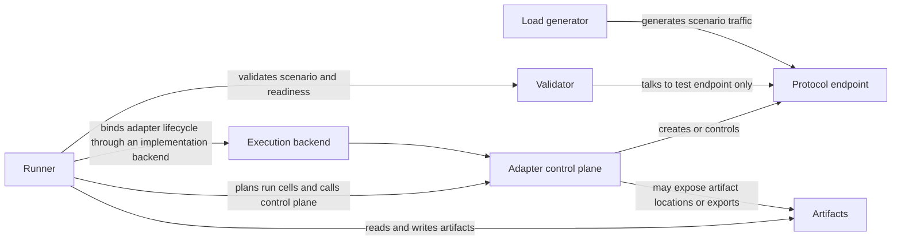

# ProtocolLab Adapter Contract v1

## Scope

This document defines the ProtocolLab adapter control plane contract for v1.
The adapter is not the protocol endpoint under test. It is a control-plane
service that prepares, starts, observes, and disposes a separate protocol
endpoint.

The control plane uses HTTP/1.1 with JSON request and response bodies so it can
be implemented by any runtime without a shared SDK.

The contract is intentionally platform-agnostic and protocol-agnostic. It does
not assume a container runtime, it does not assume the tested protocol is HTTP,
and it does not require the control plane and the protocol endpoint to live in
the same process.

## Relationship To The Rest Of ProtocolLab

The boundaries are deliberate:

- The runner owns orchestration, lifecycle sequencing, compatibility
  filtering, validation gating, load generation coordination, artifact
  capture, and reporting.
- The execution backend owns how the adapter lifecycle is started and stopped.
- The adapter owns the control plane and the session state for one scenario
  execution context.
- The protocol endpoint owns the protocol behavior under test.
- The validator and load generator talk to the protocol endpoint, not the adapter
  control plane.
- Artifacts are outputs, not control-plane state.

The same adapter contract can be satisfied by an implementation-owned backend,
an externally hosted adapter endpoint, or a future isolated execution model.

## API Surface

All routes are rooted at `/protocol-lab/adapter/v1`.

| Method | Route | Purpose |
| --- | --- | --- |
| `GET` | `/health` | Liveness, readiness, and contract discovery. |
| `GET` | `/manifest` | Adapter and implementation introspection. |
| `POST` | `/sessions` | Create a new adapter session. |
| `GET` | `/sessions/{sessionId}` | Fetch the session resource. |
| `POST` | `/sessions/{sessionId}/prepare` | Provide the scenario payload and configure the session. |
| `POST` | `/sessions/{sessionId}/start` | Start the test endpoint(s). |
| `GET` | `/sessions/{sessionId}/status` | Report lifecycle and readiness state. |
| `GET` | `/sessions/{sessionId}/endpoints` | Discover one or more test endpoints. |
| `GET` | `/sessions/{sessionId}/metrics` | Fetch a metrics snapshot if available. |
| `GET` | `/sessions/{sessionId}/artifacts` | Discover artifact locations and types. |
| `POST` | `/sessions/{sessionId}/stop` | Stop the session and test endpoint(s). |
| `DELETE` | `/sessions/{sessionId}` | Dispose the session and release state. |

Successful responses use `application/json`. Error responses use
`application/problem+json` when the request is malformed, the session is
missing, the session state transition is invalid, or the adapter experiences an
unexpected infrastructure failure.

`unsupported` is a normal adapter result, not an infrastructure failure. The
adapter SHOULD return a regular JSON response with a result category of
`unsupported` when the requested scenario, capability, endpoint type, artifact
type, or metric is not available.

### Recommended HTTP Status Usage

- `200 OK` for normal GET responses and for synchronous mutation responses.
- `201 Created` for `POST /sessions` when the adapter creates a new session
  resource.
- `202 Accepted` for mutation operations that have been accepted but are still
  in progress.
- `204 No Content` is acceptable for `DELETE /sessions/{sessionId}` if the
  adapter does not need to return a response body.
- `400 Bad Request` for malformed JSON or schema validation failures.
- `404 Not Found` for unknown session identifiers.
- `409 Conflict` for invalid session-state transitions.
- `415 Unsupported Media Type` when the request content type is not JSON.
- `500 Internal Server Error` or `503 Service Unavailable` for infrastructure
  failures.

## Response Status Enums

The contract uses a small set of response enums so the runner can reason about
state without assuming protocol-specific semantics.

### Health Status

- `ready`
- `degraded`
- `not_ready`
- `unavailable`
- `unsupported`

### Session State

- `created`
- `preparing`
- `prepared`
- `starting`
- `running`
- `ready`
- `stopping`
- `stopped`
- `failed`
- `unsupported`
- `disposed`

### Readiness Status

- `unknown`
- `not_ready`
- `ready`
- `unsupported`
- `failed`

### Operation Result Category

- `succeeded`
- `pending`
- `unsupported`
- `rejected`
- `failed`

### Resource Availability

The metrics and artifacts endpoints SHOULD report a resource availability status
using the same normal-result pattern:

- `available`
- `partial`
- `unavailable`
- `unsupported`

## Manifest And Discovery

`GET /manifest` is the primary discovery endpoint. It reports:

- adapter identity
- implementation identity
- version compatibility
- supported roles
- claimed capabilities
- supported scenario selectors
- supported endpoint types
- supported artifact types
- metrics availability

### Adapter Identity

The adapter identity describes the control-plane implementation itself.

Recommended fields:

- `adapterId`
- `adapterName`
- `adapterVersion`
- `adapterRevision`
- `adapterVendor`
- `extensions`

### Implementation Identity

The implementation identity describes the protocol implementation under test.
The adapter may control one implementation, or it may be a generic wrapper that
reports the implementation identity at session creation time.

Recommended fields:

- `implementationId`
- `implementationName`
- `implementationVersion`
- `implementationRevision`
- `implementationImage`
- `extensions`

### Version Compatibility

The manifest SHOULD report both the contract version being implemented and the
contract versions the adapter accepts.

Recommended fields:

- `contractVersion`
- `compatibleContractVersions`
- `runnerCompatibility`
- `extensions`

Version compatibility is about control-plane compatibility, not protocol
compatibility. The tested protocol may be HTTP, QUIC, WebTransport, MASQUE, or
something else entirely.

### Supported Roles

`supportedRoles` is an open-ended list of role identifiers such as `server`,
`client`, `relay`, `proxy`, or `observer`. The contract does not fix the role
vocabulary. A role is only meaningful if both the runner and adapter understand
it for a given scenario family.

### Claimed Capabilities

`claimedCapabilities` is an open-ended list of capability records. Each record
should describe:

- the capability identifier
- the capability status
- an optional version or mode qualifier
- human-readable notes
- an extensibility bag

Capabilities may be supported, partially supported, conditional, experimental,
or unsupported in a particular deployment.

### Supported Scenario Selectors

`supportedScenarioSelectors` describes how the adapter decides whether it can
handle a scenario.

Examples include, but are not limited to:

- exact scenario identifiers
- scenario identifier prefixes
- scenario family selectors
- scenario version selectors
- tag or label selectors
- custom selector expressions

The selector mechanism is intentionally open-ended. The runner should treat the
selector list as discoverable metadata, not as a closed command language.

### Supported Endpoint Types

`supportedEndpointTypes` lists the kinds of protocol endpoints the adapter can
create or control. Examples may include `tcp`, `udp`, `http`, `https`,
`quic`, `http3`, `webtransport`, or other implementation-specific endpoint
types.

The adapter must distinguish between endpoint types and the control plane. The
control plane itself is always HTTP/1.1 JSON.

### Supported Artifact Types

`supportedArtifactTypes` lists the artifact categories the adapter can expose or
export. Examples may include logs, traces, captures, dumps, metrics snapshots,
and implementation-specific diagnostic bundles.

Artifact type names are open-ended. The runner should store the values it
receives without assuming a fixed artifact taxonomy.

### Metrics Availability

`metricsAvailability` reports whether metrics are supported and, if so, what
kind of snapshot or export can be produced.

At minimum it SHOULD indicate:

- whether metrics are available at all
- whether session-level metrics are available
- whether endpoint-level metrics are available
- whether backend, endpoint, or environment metrics are available
- whether metrics are only available in certain modes

### Optional Telemetry Capability

Adapters MAY advertise optional telemetry export capability in `telemetry`.
The discovery shape is descriptive:

- `telemetry.supported`
- `telemetry.supported_contract_versions`
- `telemetry.supported_scopes`
- `telemetry.supported_artifact_kinds`
- `telemetry.export_modes`: `inline`, `artifact-bundle`, `external-uri`, or
  `none`

The runner may ask for a telemetry bundle after a run. The adapter may return
no telemetry. A telemetry export failure is diagnostic unless the run plan
explicitly requires telemetry export. A telemetry bundle must not change
conformance pass/fail results after the fact, but it may affect evidence
quality, comparability, and diagnostic value.

Implementation telemetry from an adapter is auxiliary evidence unless a run
plan explicitly requires it. The adapter contract does not require any
particular telemetry backend or raw artifact format.

## Session Lifecycle

The minimum lifecycle is:

1. `POST /sessions`
2. `POST /sessions/{sessionId}/prepare`
3. `POST /sessions/{sessionId}/start`
4. `GET /sessions/{sessionId}/status`
5. `GET /sessions/{sessionId}/endpoints`
6. `GET /sessions/{sessionId}/metrics`
7. `GET /sessions/{sessionId}/artifacts`
8. `POST /sessions/{sessionId}/stop`
9. `DELETE /sessions/{sessionId}`

The lifecycle is intentionally narrow. Adapters may expose extra routes, but the
runner must not require extra routes for v1.

### Session Creation

`POST /sessions` creates a new session handle. The response should return the
new `sessionId` and the initial session state.

The create request may include a runner-provided session hint, run identifier,
cell identifier, or extension bag, but it should not carry the scenario payload.

### Prepare / Configure

`POST /sessions/{sessionId}/prepare` carries the scenario payload and the
requested bindings.

The runner passes the following fields through this request:

- `scenarioId`
- `scenarioVersion`
- `role`
- opaque `scenarioDocument`
- `requestedEndpointBindings`
- `runId`
- `cellId`
- artifact output expectations
- extensibility bag

The prepare request is the place where the adapter learns what it must
configure, not where the runner assumes a specific protocol or load pattern.

### Start

`POST /sessions/{sessionId}/start` tells the adapter to start whatever protocol
endpoint(s) it manages for the session. A session may transition through
`starting` to `running` or `ready`, depending on the implementation.

### Status And Readiness

`GET /sessions/{sessionId}/status` reports lifecycle state and readiness.

The status response should separate:

- current session state
- readiness status
- last transition or observation time
- warnings or notes
- extensibility data

### Endpoint Discovery

`GET /sessions/{sessionId}/endpoints` returns zero or more protocol endpoints.
It is the only place where the runner should learn the test endpoint host,
port, scheme, protocol, path, and TLS notes.

The control plane host and port are not implicitly the test endpoint host and
port.

### Metrics Snapshot

`GET /sessions/{sessionId}/metrics` returns a best-effort metrics snapshot when
available. The adapter may return `unsupported` if it does not expose metrics.

The snapshot SHOULD report:

- snapshot time
- availability
- metric scope
- metric name
- metric value
- metric unit
- optional notes
- extensibility data

### Artifact Discovery

`GET /sessions/{sessionId}/artifacts` returns the artifacts that the adapter has
made available for the current session. The artifacts may be files, URIs,
directory roots, or implementation-specific artifact handles.

The adapter should distinguish:

- artifact type
- availability
- location or path
- content type if known
- whether the artifact is final or still growing
- extensibility data

### Stop And Dispose

`POST /sessions/{sessionId}/stop` requests an orderly shutdown of the session
and any managed test endpoints.

`DELETE /sessions/{sessionId}` disposes the session state and releases any
remaining adapter resources.

Both operations may return `unsupported` if the adapter can describe the
session but cannot honor the shutdown request in the current mode. That is a
normal result, not a transport failure.

## Scenario Payload

The prepare request should treat the scenario as opaque data except for the
fields the runner must use for routing and bookkeeping.

### Required Scenario Payload Fields

- `scenarioId`
- `scenarioVersion`
- `role`
- `scenarioDocument`
- `requestedEndpointBindings`
- `runId`
- `cellId`
- `artifactOutputExpectations`
- `extensions`

### Requested Endpoint Bindings

Each binding describes a requested test endpoint relationship, such as:

- primary endpoint
- secondary endpoint
- control or helper endpoint
- client-visible or server-visible binding
- protocol-specific helper binding

The contract does not define the protocol semantics of a binding. It only
provides a structured place for the runner to say what it needs.

### Artifact Output Expectations

Artifact expectations are advisory. They let the runner tell the adapter what
outputs matter for the current cell so the adapter can disclose whether it can
provide them.

### Extensibility Bag

Every major request and response shape should include an extensibility bag:

- the runner may send extra fields the adapter can ignore
- the adapter may return extra fields the runner can preserve
- the contract remains forward-compatible without losing unknown data

## Test Endpoint Shape

The endpoint discovery response should return one or more endpoint records with
at least these fields:

- `endpointId`
- `endpointPurpose`
- `scheme`
- `protocol`
- `host`
- `port`
- `path` when applicable
- TLS or certificate notes when applicable
- metadata or extensibility data

Additional recommended fields:

- `authority`
- `socketAddress`
- `networkMode`
- `bindMode`
- `certificateMode`
- `sni`
- `notes`

The runner should treat these endpoint records as the only authoritative source
for protocol-target connection details.

## Errors And Problem Details

When the request itself is invalid or the adapter cannot complete the request
for infrastructure reasons, the response SHOULD use `application/problem+json`.

Recommended problem details fields:

- standard RFC 7807 fields: `type`, `title`, `status`, `detail`, `instance`
- adapter-specific code
- adapter status at failure time
- session identifier if available
- operation name
- retryability hint
- unsupported reason if applicable
- extensibility data

Typical problem categories include:

- malformed JSON
- schema validation failure
- missing or unknown session
- invalid session state transition
- unsupported media type
- unexpected adapter failure

`unsupported` scenario handling should not use problem details unless the
request itself is malformed. If the adapter cannot support a scenario or
endpoint type, it should return a regular JSON response with an
`unsupported` operation result category.

## Execution Models

The contract is designed to survive different execution backends without
changing the HTTP API.

- `implementation-managed`: the implementation owns how the adapter endpoint
  is made available.
- `external-host`: the runner connects to an already available adapter
  endpoint.
- `isolated-backend`: an implementation-owned backend provides isolation
  without changing the public adapter contract.
- future execution backends may follow the same contract without
  changing the protocol.

The backend choice is an orchestration concern. It does not change the adapter
routes, the request bodies, or the response schema.

## Schema Files

The primary schema files live under [`schemas/adapter/v1/`](../../schemas/adapter/v1/) and describe the
request and response shapes for the routes above.

The schema set is intentionally small and should stay focused on the primary
contract surfaces rather than on protocol-specific behavior.
